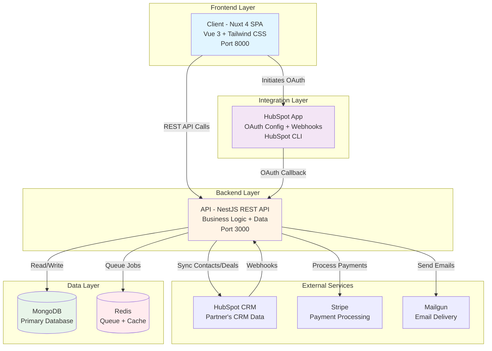
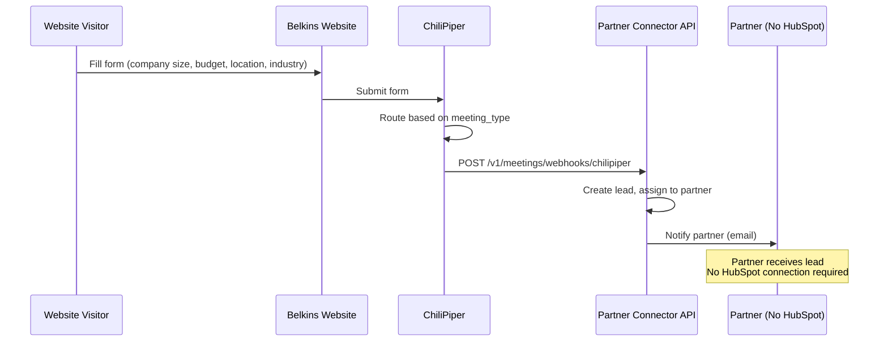
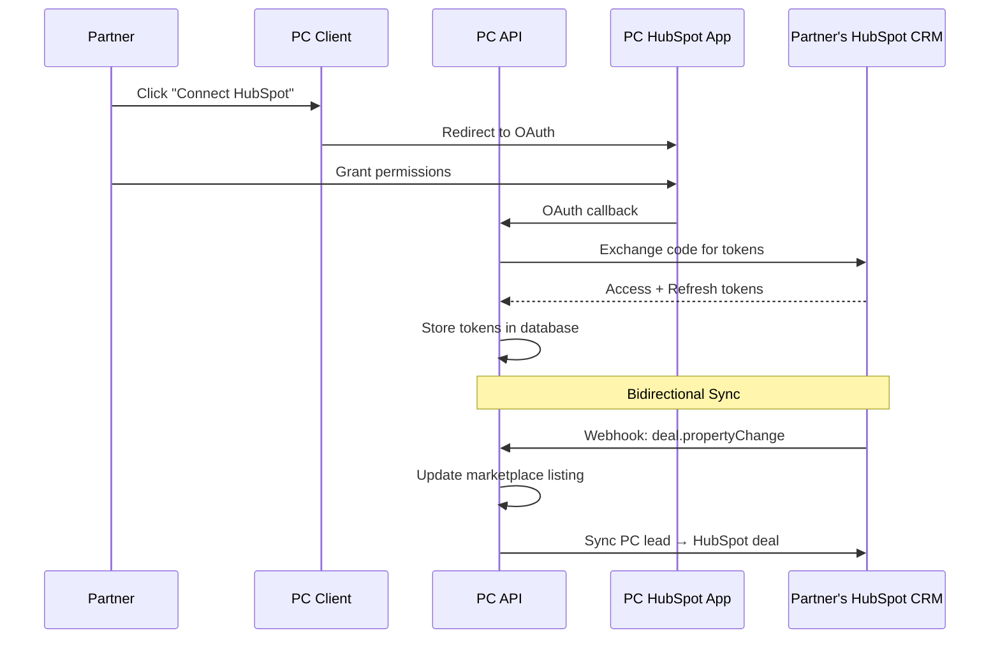
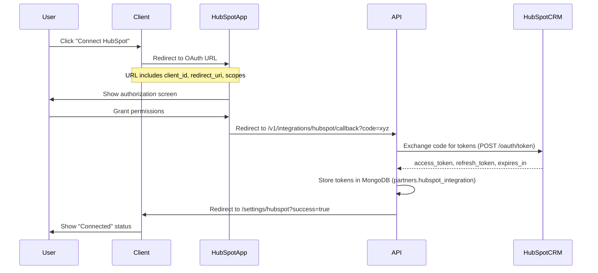
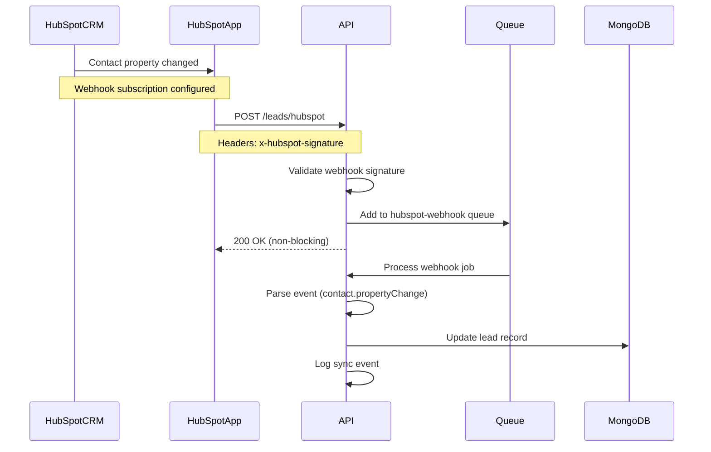
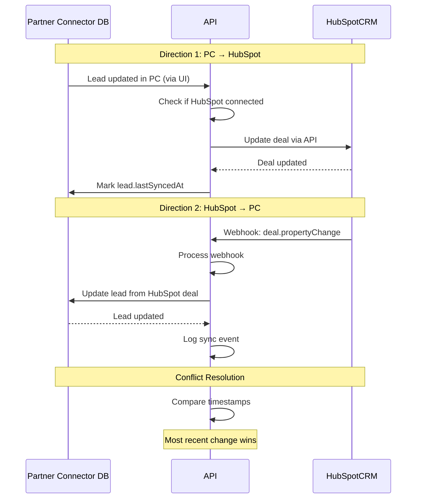
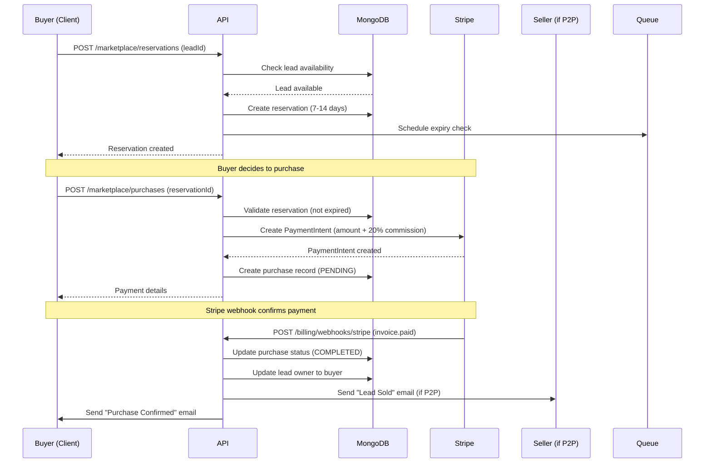
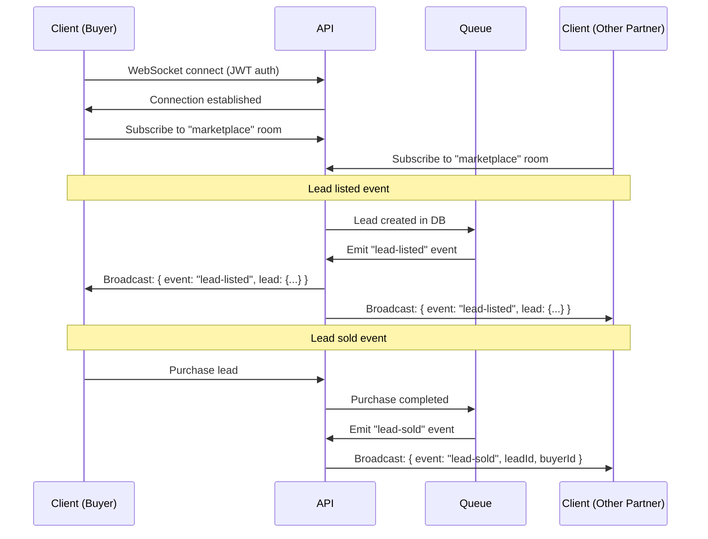
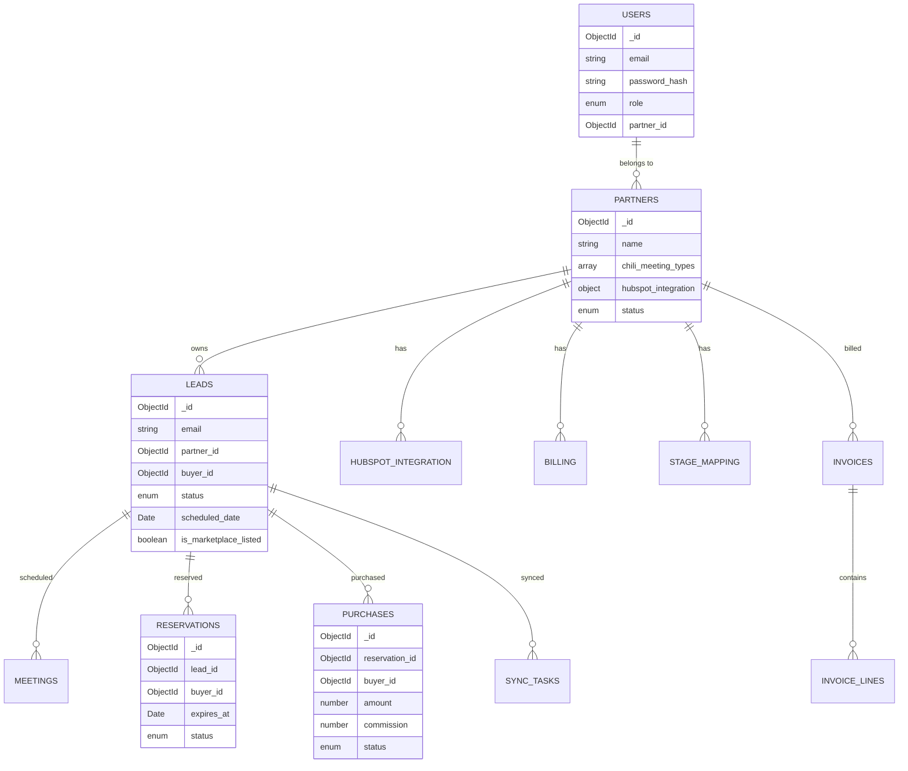

# Partner Connector Platform Architecture

**Last Updated:** January 28, 2026
**Version:** 1.0
**Status:** Production

---

## Table of Contents

1. [System Overview](#system-overview)
2. [Repository Responsibilities](#repository-responsibilities)
3. [Component Architecture](#component-architecture)
4. [Integration Flows](#integration-flows)
5. [Data Flow](#data-flow)
6. [Technology Stack](#technology-stack)
7. [Key Files Reference](#key-files-reference)
8. [Deployment Architecture](#deployment-architecture)

---

## System Overview

Partner Connector is a **lead marketplace platform** built as a **microservices architecture** spanning 4 repositories:



### Platform Purpose

**Business Model:**
- Agencies buy and sell non-fit SQLs (Sales Qualified Leads)
- Current: Belkins = only seller, 10 partners = buyers
- Future: All partners can sell + buy (peer-to-peer marketplace)
- Revenue: 100% on Belkins sales now, 20% commission on P2P later

---

## HubSpot Integration Distinction

Partner Connector has **TWO SEPARATE HubSpot integrations** that serve different purposes:

### Integration 1: Belkins Website Routing (ChiliPiper)

**Purpose:** Route leads from Belkins website to partners

**Flow:**


**Key Characteristics:**
- ❌ Partners do NOT connect their HubSpot
- ✅ Belkins manages partners manually (10 current partners)
- ✅ Routing based on form criteria (company size 201-500, budget $5,000+)
- ✅ ChiliPiper webhook triggers lead assignment
- ✅ Partners can't validate their own activity (no CRM integration)

**Why "Connect Later":**
- Current 10 partners work with Belkins through manual process
- Belkins does manual work to manage these relationships
- No automation - partners just receive lead notifications

**Code Location:**
- API Endpoint: `/v1/meetings/webhooks/chilipiper`
- Service: `api/src/modules/meetings/meetings.service.ts`
- Processor: `api/src/modules/meetings/chilipiper-webhook.processor.ts`

---

### Integration 2: Partner Connector Marketplace (OAuth)

**Purpose:** Automated marketplace for partners to buy/sell leads with CRM sync

**Flow:**


**Key Characteristics:**
- ✅ Partners MUST connect their HubSpot via OAuth
- ✅ Bidirectional sync (PC ↔ Partner's CRM)
- ✅ Automated marketplace listing based on deal stages
- ✅ Partners can buy/sell leads from each other
- ✅ Real-time sync of deal progress

**HubSpot App:**
- New "Partner Connector" HubSpot app (separate from Belkins app)
- OAuth scopes: contacts.read, contacts.write, deals.read, deals.write
- Webhooks: contact.propertyChange, deal.propertyChange

**Code Location:**
- OAuth: `api/src/modules/integrations/integrations.service.ts`
- Sync: `api/src/modules/sync/bidirectional-sync.service.ts`
- Config: `partner-connector-hubspot-app/src/app/app.json`

---

### Summary Table

| Aspect | Integration 1 (ChiliPiper) | Integration 2 (Marketplace) |
|--------|---------------------------|----------------------------|
| **Purpose** | Route Belkins leads to partners | P2P marketplace with CRM sync |
| **Partner HubSpot** | ❌ Not connected | ✅ OAuth connected |
| **Flow Trigger** | ChiliPiper webhook | Partner connects HubSpot |
| **Automation** | Manual (Belkins manages) | Fully automated |
| **Current Users** | 10 Belkins partners | Future: All marketplace partners |
| **HubSpot App** | Belkins HubSpot app | Partner Connector HubSpot app |
| **API Endpoint** | `/v1/meetings/webhooks/chilipiper` | `/v1/integrations/hubspot/*` |
| **Code Module** | `meetings/` | `integrations/`, `sync/` |

---

## Repository Responsibilities

### 1. API Repository (`api`)

**GitHub:** [partner-connector/api](https://github.com/partner-connector/api)

**Purpose:** Core backend handling all business logic, data management, and integrations

**What It Does:**
- ✅ REST API endpoints (authenticated with JWT)
- ✅ User authentication and authorization (Owner/Admin/User roles)
- ✅ Partner management (CRUD + stats)
- ✅ Lead inventory management (create, update, notes, import)
- ✅ HubSpot OAuth token storage and refresh
- ✅ HubSpot bidirectional sync (PC ↔ HubSpot CRM)
- ✅ Marketplace reservations and purchases
- ✅ Stripe payment processing (invoices, charges, credits)
- ✅ Email notifications via Mailgun
- ✅ ChiliPiper meeting webhook processing
- ✅ Background job processing (BullMQ queues)
- ✅ WebSocket real-time updates (marketplace events)

**What It Doesn't Do:**
- ❌ OAuth app configuration (HubSpot App repo)
- ❌ UI rendering (Client repo)
- ❌ Direct HubSpot Marketplace listing (HubSpot App repo)

**Tech Stack:**
- NestJS 10.x (TypeScript)
- MongoDB (Mongoose ODM)
- Redis (BullMQ for queues)
- Passport JWT authentication
- Swagger/OpenAPI documentation
- Jest for testing

**Port:** 3000
**Environments:** Local, Staging, Production

---

### 2. Client Repository (`client`)

**GitHub:** [partner-connector/client](https://github.com/partner-connector/client)

**Purpose:** User-facing web application (single-page application)

**What It Does:**
- ✅ Dashboard UI for partners and admins
- ✅ Lead browsing and filtering
- ✅ Marketplace lead reservations and purchases
- ✅ Partner settings and profile management
- ✅ HubSpot OAuth flow initiation (redirects to HubSpot)
- ✅ Real-time marketplace updates (WebSocket client)
- ✅ Responsive design with Tailwind CSS
- ✅ Authentication UI (login, logout, token refresh)

**What It Doesn't Do:**
- ❌ Business logic (API repo)
- ❌ Data persistence (API repo)
- ❌ HubSpot API calls (API repo)
- ❌ Payment processing (API repo via Stripe)

**Tech Stack:**
- Nuxt 4 (Vue 3 framework)
- TypeScript
- Tailwind CSS
- Pinia (state management)
- Vite (build tool)
- Socket.IO client (WebSockets)

**Port:** 8000
**Environments:** Local, Staging (Vercel), Production (Vercel)

---

### 3. HubSpot App Repository (`partner-connector-hubspot-app`)

**GitHub:** [partner-connector/partner-connector-hubspot-app](https://github.com/partner-connector/partner-connector-hubspot-app)

**Purpose:** HubSpot Marketplace app configuration (OAuth + webhooks)

**What It Does:**
- ✅ Defines OAuth scopes (contacts, deals, CRM permissions)
- ✅ Configures OAuth redirect URI (points to API callback)
- ✅ Registers webhook subscriptions (contact/deal property changes)
- ✅ Sets webhook signature secret
- ✅ Defines app metadata for HubSpot Marketplace (future)

**What It Doesn't Do:**
- ❌ OAuth callback processing (API repo)
- ❌ Webhook event handling (API repo)
- ❌ Token storage (API repo)
- ❌ CRM data sync logic (API repo)

**Tech Stack:**
- HubSpot CLI
- JSON configuration (`app.json`)
- No runtime code - pure configuration

**Deployment:** Uploaded to HubSpot via CLI (`hs project upload`)

---

### 4. Organization Docs Repository (`.github`)

**GitHub:** [partner-connector/.github](https://github.com/partner-connector/.github)

**Purpose:** Cross-repository documentation, architecture, and governance

**What It Contains:**
- ✅ Implementation plans (6 sprints roadmap)
- ✅ Architecture documentation (this file)
- ✅ Getting started guide for new developers
- ✅ OAuth integration guide (future - Phase 2.2)
- ✅ Webhook flow documentation (future - Phase 2.3)
- ✅ Environment variable reference (future - Phase 3.2)
- ✅ Deployment coordination guides (future - Phase 4)
- ✅ Troubleshooting guides (future - Phase 5)

**Tech Stack:**
- Markdown
- Mermaid diagrams

---

## Component Architecture

### API Module Structure

```
api/
├── src/
│   ├── modules/
│   │   ├── auth/              # JWT authentication
│   │   ├── users/             # User management
│   │   ├── partners/          # Partner CRUD + stats
│   │   ├── leads/             # Lead inventory
│   │   ├── marketplace/       # Reservations + purchases
│   │   ├── billing/           # Stripe invoices
│   │   ├── integrations/      # HubSpot OAuth + sync
│   │   ├── sync/              # Bidirectional HubSpot sync
│   │   ├── stage-mapping/     # Pipeline stage translation
│   │   ├── cross-partner-sync/ # Buyer → Seller sync
│   │   ├── websocket/         # Real-time events
│   │   ├── meetings/          # ChiliPiper webhooks
│   │   └── public-api/        # Partner API tokens
│   ├── common/
│   │   ├── guards/            # AuthGuard, RoleGuard
│   │   ├── decorators/        # Route decorators
│   │   ├── interceptors/      # Response serialization
│   │   ├── hubspot/           # HubSpot SDK wrapper
│   │   ├── mailgun/           # Email service
│   │   └── stripe/            # Stripe SDK wrapper
│   └── static/                # Enums, constants
```

**Pattern:** Controller → Service → Repository → Database

**Example Flow:**
```typescript
// 1. Controller (HTTP layer)
@Controller('leads')
export class LeadsController {
  constructor(private readonly leadsService: LeadsService) {}

  @Get()
  @RouteGuard({ roles: [Role.Admin] })
  async getMany(@Query() query: GetLeadsDto) {
    return this.leadsService.getMany(query);
  }
}

// 2. Service (business logic)
@Injectable()
export class LeadsService {
  constructor(private readonly leadsRepository: LeadsRepository) {}

  async getMany(query: GetLeadsDto) {
    return this.leadsRepository.getMany(query);
  }
}

// 3. Repository (data access)
@Injectable()
export class LeadsRepository {
  constructor(@InjectModel(Lead.name) private leadModel: Model<Lead>) {}

  async getMany(query: GetLeadsDto) {
    return this.leadModel.find(query).lean();
  }
}
```

---

### Client Component Structure

```
client/
├── pages/                     # File-based routing
│   ├── index.vue              # Dashboard
│   ├── leads/
│   │   ├── index.vue          # Lead list
│   │   └── [id].vue           # Lead detail
│   ├── marketplace/           # Marketplace UI
│   └── settings/
│       └── hubspot.vue        # HubSpot OAuth
├── components/
│   ├── LeadCard.vue
│   ├── ReservationModal.vue
│   └── PurchaseConfirmation.vue
├── composables/
│   ├── useAuth.ts             # Authentication logic
│   ├── useLeads.ts            # Lead API calls
│   ├── useMarketplace.ts      # Marketplace API calls
│   └── useWebSocket.ts        # Real-time updates
├── gateway/                   # API client layer
│   ├── auth.ts
│   ├── leads.ts
│   └── marketplace.ts
└── stores/
    ├── auth.ts                # Pinia auth store
    └── marketplace.ts         # Pinia marketplace store
```

**Pattern:** Page → Composable → Gateway → API

---

## Integration Flows

### 1. HubSpot OAuth Flow

**Purpose:** Connect partner's HubSpot account to sync CRM data



**Key Files:**

| Repository | File | Purpose |
|------------|------|---------|
| **HubSpot App** | `src/app/app.json` | OAuth config (scopes, redirect_uri) |
| **Client** | `pages/settings/hubspot.vue` | Initiate OAuth button |
| **API** | `src/modules/integrations/integrations.controller.ts` | `/callback` endpoint |
| **API** | `src/modules/integrations/integrations.service.ts` | Token exchange logic |

**OAuth Scopes Required:**
- `crm.objects.contacts.read`
- `crm.objects.contacts.write`
- `crm.objects.deals.read`
- `crm.objects.deals.write`

---

### 2. HubSpot Webhook Flow

**Purpose:** Real-time sync when partner updates contacts/deals in HubSpot



**Key Files:**

| Repository | File | Purpose |
|------------|------|---------|
| **HubSpot App** | `src/app/app.json` | Webhook subscriptions config |
| **API** | `src/modules/leads/leads.controller.ts` | `/webhooks/hubspot` endpoint |
| **API** | `src/modules/leads/hubspot-webhook.processor.ts` | Async webhook processing |
| **API** | `src/common/guards/hubspot-webhook.guard.ts` | Signature validation |

**Webhook Events Subscribed:**
- `contact.propertyChange` - Contact field updated
- `deal.propertyChange` - Deal field updated

---

### 3. Bidirectional Sync Flow

**Purpose:** Two-way sync between Partner Connector and HubSpot CRM



**Key Files:**

| Repository | File | Purpose |
|------------|------|---------|
| **API** | `src/modules/sync/bidirectional-sync.service.ts` | Sync orchestration |
| **API** | `src/modules/sync/sync.repository.ts` | Sync task tracking |
| **API** | `src/modules/sync/conflict.service.ts` | Conflict detection/resolution |

**Sync Triggers:**
- Manual: Partner clicks "Sync Now" in UI
- Scheduled: Kubernetes CronJob every 15 minutes
- Real-time: Webhook from HubSpot

---

### 4. Marketplace Purchase Flow

**Purpose:** Partner reserves and purchases leads from marketplace



**Key Files:**

| Repository | File | Purpose |
|------------|------|---------|
| **API** | `src/modules/marketplace/reservation.service.ts` | Reservation logic |
| **API** | `src/modules/marketplace/purchase.service.ts` | Purchase processing |
| **API** | `src/modules/billing/stripe-webhook.processor.ts` | Payment confirmation |
| **API** | `src/modules/billing/billing.service.ts` | Invoice generation |

**Commission Model:**
- Current: 100% revenue on Belkins leads (no commission)
- Future: 20% platform commission on P2P sales

---

### 5. Real-Time WebSocket Flow

**Purpose:** Live marketplace updates to all connected clients



**Key Files:**

| Repository | File | Purpose |
|------------|------|---------|
| **API** | `src/modules/websocket/websocket.gateway.ts` | Socket.IO gateway |
| **Client** | `composables/useWebSocket.ts` | WebSocket client logic |

**WebSocket Events:**
- `lead-listed` - New lead available
- `lead-sold` - Lead purchased
- `stage-updated` - Deal stage changed
- `viewer-joined` - Partner viewing lead
- `viewer-left` - Partner stopped viewing

---

## Data Flow

### Entity Relationships



---

## Technology Stack

### Backend (API)

| Technology | Version | Purpose |
|------------|---------|---------|
| **Node.js** | 22.x | Runtime |
| **NestJS** | 10.x | Framework |
| **TypeScript** | 5.x | Language |
| **MongoDB** | 7.x | Database |
| **Mongoose** | 8.x | ODM |
| **Redis** | 7.x | Queue + Cache |
| **BullMQ** | 5.x | Job queues |
| **Passport JWT** | 10.x | Authentication |
| **Stripe SDK** | Latest | Payments |
| **Socket.IO** | 4.x | WebSockets |
| **Jest** | 29.x | Testing |
| **Swagger** | 7.x | API docs |

---

### Frontend (Client)

| Technology | Version | Purpose |
|------------|---------|---------|
| **Node.js** | 20.18.1+ | Runtime |
| **Nuxt** | 4.x | Framework |
| **Vue** | 3.x | UI library |
| **TypeScript** | 5.x | Language |
| **Tailwind CSS** | 3.x | Styling |
| **Pinia** | 2.x | State management |
| **Vite** | 5.x | Build tool |
| **Socket.IO Client** | 4.x | WebSockets |

---

### Infrastructure

| Technology | Purpose |
|------------|---------|
| **Kubernetes** | Container orchestration |
| **Docker** | Containerization |
| **GitHub Actions** | CI/CD |
| **ArgoCD** | GitOps deployment |
| **Keel** | Auto-updates |
| **DigitalOcean** | Cloud hosting |
| **Vercel** | Client hosting |
| **BetterStack** | Monitoring |

---

## Key Files Reference

### API Repository

| File | Lines | Purpose |
|------|-------|---------|
| `src/main.ts` | 150 | App bootstrap, CORS, Swagger |
| `src/app.module.ts` | 200 | Root module, all imports |
| `src/modules/auth/auth.service.ts` | 300 | JWT authentication |
| `src/modules/partners/partners.service.ts` | 450 | Partner management |
| `src/modules/leads/leads.service.ts` | 600 | Lead inventory |
| `src/modules/marketplace/reservation.service.ts` | 360 | Reservation system |
| `src/modules/marketplace/purchase.service.ts` | 219 | Purchase processing |
| `src/modules/sync/bidirectional-sync.service.ts` | 400 | HubSpot sync |
| `src/modules/websocket/websocket.gateway.ts` | 350 | Real-time events |
| `src/common/hubspot/hubspot.helper.ts` | 500 | HubSpot SDK wrapper |
| `src/common/stripe/stripe.service.ts` | 350 | Stripe integration |
| `src/common/guards/auth.guard.ts` | 150 | JWT validation |

**Total:** ~63KB CLAUDE.md + 8 modular rule files

---

### Client Repository

| File | Lines | Purpose |
|------|-------|---------|
| `app.vue` | 100 | Root component |
| `pages/index.vue` | 200 | Dashboard |
| `pages/leads/index.vue` | 300 | Lead list |
| `pages/marketplace/index.vue` | 400 | Marketplace UI |
| `composables/useAuth.ts` | 150 | Auth logic |
| `composables/useLeads.ts` | 200 | Lead API calls |
| `composables/useMarketplace.ts` | 250 | Marketplace API |
| `composables/useWebSocket.ts` | 180 | WebSocket client |
| `gateway/auth.ts` | 100 | Auth API client |
| `gateway/leads.ts` | 150 | Leads API client |

**Total:** 16 documentation files in `.claude/frontend-system/`

---

### HubSpot App Repository

| File | Lines | Purpose |
|------|-------|---------|
| `src/app/app.json` | 100 | OAuth + webhook config |
| `README.md` | 200 | Setup instructions |

---

## Deployment Architecture

### Staging Environment

```
Kubernetes Namespace: partner-connector-staging

┌─────────────────────────────────────────────┐
│  Ingress (nginx)                            │
│  TLS: staging-api.partners.belkins.io       │
└──────────────┬──────────────────────────────┘
               │
               ▼
┌─────────────────────────────────────────────┐
│  API Service (ClusterIP:80)                 │
└──────────────┬──────────────────────────────┘
               │
               ▼
┌─────────────────────────────────────────────┐
│  API Deployment (2 replicas)                │
│  - Container: api:staging-latest            │
│  - Resources: CPU 100m-500m, Mem 128Mi-512Mi│
│  - Health checks: /health                   │
└──────────────┬──────────────────────────────┘
               │
        ┌──────┴──────┐
        ▼             ▼
┌──────────────┐  ┌──────────────┐
│  MongoDB     │  │  Redis       │
│  (Atlas)     │  │  (StatefulSet)│
└──────────────┘  └──────────────┘
```

**CronJobs:**
- Monthly invoices: `0 0 1 * *` (1st @ midnight UTC)
- Daily reminders: `0 9 * * *` (9 AM UTC)
- Partner sync: `*/15 * * * *` (every 15 min)

---

### Production Environment

```
Kubernetes Namespace: partner-connector

┌─────────────────────────────────────────────┐
│  Ingress (nginx)                            │
│  TLS: api.partners.belkins.io               │
└──────────────┬──────────────────────────────┘
               │
               ▼
┌─────────────────────────────────────────────┐
│  API Service (ClusterIP:80)                 │
└──────────────┬──────────────────────────────┘
               │
               ▼
┌─────────────────────────────────────────────┐
│  API Deployment (3 replicas)                │
│  - Container: api:production-vX.Y.Z         │
│  - Resources: CPU 200m-1000m, Mem 256Mi-1Gi │
│  - Health checks: /health                   │
│  - Liveness: 30s timeout                    │
│  - Readiness: 5s timeout                    │
└──────────────┬──────────────────────────────┘
               │
        ┌──────┴──────────┬─────────────┐
        ▼                 ▼             ▼
┌──────────────┐  ┌──────────────┐  ┌──────────────┐
│  MongoDB     │  │  Redis       │  │  BetterStack │
│  (Atlas)     │  │  (StatefulSet)│  │  (Sentry)    │
│              │  │  - 5Gi PVC   │  │              │
└──────────────┘  └──────────────┘  └──────────────┘
```

**High Availability:**
- 3 API replicas for load balancing
- Redis StatefulSet with persistent volume
- MongoDB Atlas with replica set
- Zero-downtime rolling updates

---

## Security Architecture

### Authentication Flow

```
1. User signs in → API validates credentials
2. API issues access token (30 min) + refresh token (30 days)
3. Tokens stored as HTTP-only cookies
4. AuthGuard validates JWT on every request
5. Auto-refresh if access token expired
```

### Authorization Hierarchy

```
Owner (highest privileges)
  ├─ Can manage all partners
  ├─ Can access all leads
  ├─ Can view system-wide stats
  └─ Can create/delete admins

Admin
  ├─ Can manage assigned partner
  ├─ Can access partner's leads
  ├─ Can create/delete users
  └─ Cannot access other partners

User (read-only)
  ├─ Can view assigned partner's leads
  ├─ Cannot modify data
  └─ Cannot access other partners
```

### API Security

- **JWT validation** on all protected routes
- **Role-based access control** (RBAC)
- **Rate limiting** (future - Phase 5)
- **CORS whitelist** for client origin
- **Webhook signature validation** (HubSpot, Stripe)
- **Input validation** with class-validator
- **SQL injection prevention** (Mongoose parameterization)
- **XSS prevention** (Vue 3 auto-escaping)

---

## Next Steps

### For New Developers
1. Read [GETTING_STARTED.md](./GETTING_STARTED.md) - Setup all 4 repos (<3 hours)
2. Review [OAuth Integration Guide](./OAUTH_INTEGRATION_GUIDE.md) - Understand OAuth flow (Phase 2.2)
3. Review [Webhook Flow Guide](./WEBHOOK_FLOWS.md) - Understand webhooks (Phase 2.3)

### For Feature Development
1. Identify which repository owns the feature
2. Follow module structure pattern (Controller → Service → Repository)
3. Add tests (unit + integration)
4. Update Swagger docs if public API
5. Update this architecture doc if adding new integration

### For DevOps
1. Review [Deployment Runbook](https://github.com/partner-connector/api/blob/main/docs/DEPLOYMENT_RUNBOOK.md)
2. Review [CI/CD Pipeline Guide](https://github.com/partner-connector/api/blob/main/docs/CICD_PIPELINE.md)
3. Review [Kubernetes manifests](https://github.com/partner-connector/api/tree/main/k8s)

---

**Last Updated:** January 28, 2026 | **Next Review:** February 28, 2026
