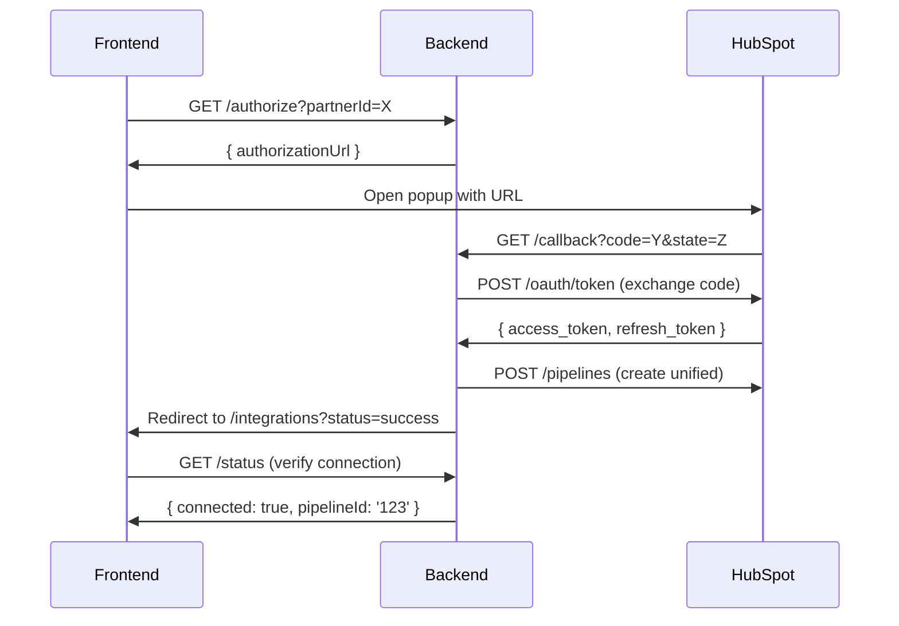
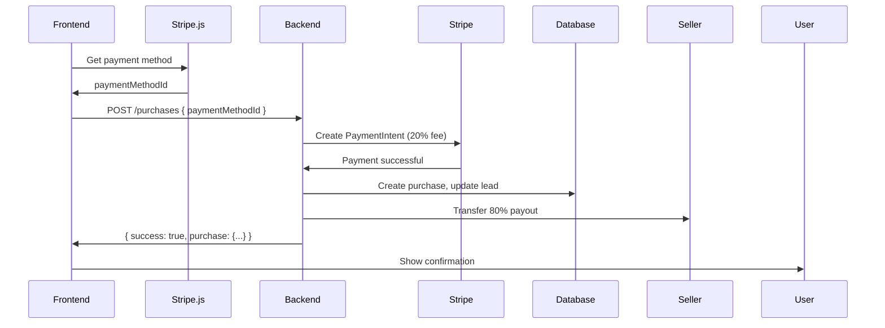

# Bidirectional Marketplace: Cross-Repository Coordination

**Organization:** partner-connector
**Repositories:** api, client, .github

---

## Overview

This document coordinates implementation across frontend and backend repositories for the bidirectional marketplace transformation.

**Implementation Timeline:** 11-15 weeks (6 sprints)

---

## Repository Structure

```
partner-connector/
├── api/                    Backend (NestJS)
│   └── docs/              Implementation guides
│       ├── BIDIRECTIONAL_MARKETPLACE_PLAN.md
│       ├── SPRINT_7_PARTNER_REGISTRATION.md
│       ├── SPRINT_8_HUBSPOT_OAUTH.md
│       ├── SPRINT_9_MARKETPLACE_APIS.md
│       ├── SPRINT_10_RESERVATION_PURCHASE.md
│       ├── SPRINT_11_BIDIRECTIONAL_SYNC.md
│       ├── SPRINT_12_ACTIVITY_ANALYTICS.md
│       └── DATABASE_SCHEMA_CHANGES.md
│
├── client/                Frontend (Next.js/React)
│   └── docs/
│       └── BIDIRECTIONAL_MARKETPLACE_FRONTEND.md
│
└── .github/               Organization docs
    └── BIDIRECTIONAL_MARKETPLACE_COORDINATION.md (this file)
```

---

## Sprint Coordination Matrix

| Sprint | Backend Tasks | Frontend Tasks | Dependencies | Duration |
|--------|---------------|----------------|--------------|----------|
| **Sprint 7** | Partner registration API, email verification, onboarding tracking | Registration form, verification page, ICP config UI, onboarding widget | None | 1-2 weeks |
| **Sprint 8** | OAuth flow, token encryption, pipeline creation | OAuth popup, connection status, pipeline modal | Sprint 7 (partners exist) | 2-3 weeks |
| **Sprint 9** | Marketplace APIs, ICP matching, view tracking | Browse page, filters, lead cards, list modal, my listings | Sprint 7 (partners exist) | 2-3 weeks |
| **Sprint 10** | Reservation system, Stripe integration, expiry cron | Reserve modal, countdown timers, Stripe checkout, purchase history | Sprint 9 (marketplace APIs) | 2-3 weeks |
| **Sprint 11** | Bidirectional sync, conflict detection, webhooks | Sync dashboard, conflict resolution UI, real-time updates | Sprint 8 (HubSpot connected) | 2-3 weeks |
| **Sprint 12** | Activity feed, notifications, analytics aggregations | Activity timeline, notification settings, charts/dashboards | Sprint 10 (purchase events) | 1-2 weeks |

---

## Sprint 7: Partner Self-Registration

### Backend Implementation
**Repository:** partner-connector/api
**Documentation:** [docs/SPRINT_7_PARTNER_REGISTRATION.md](https://github.com/partner-connector/api/blob/main/docs/SPRINT_7_PARTNER_REGISTRATION.md)

**Key Deliverables:**
- POST /v1/auth/register-partner (public)
- POST /v1/auth/verify-registration (public)
- POST /v1/partners/:id/activate (owner only)
- GET /v1/partners/:id/onboarding (admin/owner)
- Mailgun email templates
- Partner & User schema extensions

**Database Changes:**
- Partners: status, onboardingSteps, registrationToken
- Users: isPartnerOwner

### Frontend Implementation
**Repository:** partner-connector/client
**Documentation:** [docs/BIDIRECTIONAL_MARKETPLACE_FRONTEND.md](https://github.com/partner-connector/client/blob/main/docs/BIDIRECTIONAL_MARKETPLACE_FRONTEND.md#sprint-7-partner-self-registration-frontend)

**Key Deliverables:**
- /register page
- /verify page
- /settings/icp page
- OnboardingProgress component
- RegistrationForm component

**API Calls:**
- POST /v1/auth/register-partner
- POST /v1/auth/verify-registration
- GET /v1/partners/:id/onboarding
- PATCH /v1/partners/:id (ICP config)

### Integration Points

| Event | Backend Action | Frontend Response |
|-------|----------------|-------------------|
| User submits registration | Creates partner + user, sends email | Shows "Check your email" message |
| User clicks email link | Token validated | Opens /verify page with token |
| User sets password | Password saved, JWT issued | Redirects to /dashboard, shows onboarding widget |
| User configures ICP | Updates partner.icp, onboardingSteps.icpConfigured = true | Onboarding progress updates to 25% |

### Testing Coordination

**Backend Tests:**
- Unit: Partner/user creation, slug generation, token validation
- E2E: Full registration flow

**Frontend Tests:**
- Unit: Form validation, password strength
- E2E: Complete flow from /register to /dashboard

**Integration Test:**
1. Frontend submits registration
2. Backend creates partner
3. Frontend shows confirmation
4. Email received (manual check)
5. Frontend handles verification
6. Backend validates token
7. Frontend shows dashboard

---

## Sprint 8: HubSpot OAuth 2.0

### Backend Implementation
**Repository:** partner-connector/api
**Documentation:** [docs/SPRINT_8_HUBSPOT_OAUTH.md](https://github.com/partner-connector/api/blob/main/docs/SPRINT_8_HUBSPOT_OAUTH.md)

**Key Deliverables:**
- GET /v1/integrations/hubspot/authorize
- GET /v1/integrations/hubspot/callback (public)
- POST /v1/integrations/hubspot/:partnerId/create-pipeline
- DELETE /v1/integrations/hubspot/:partnerId
- AES-256-GCM token encryption
- Token refresh cron job

**Database Changes:**
- New collection: HUBSPOT_CONNECTIONS
- Partners: hubspotConnection (ObjectId ref)

### Frontend Implementation
**Repository:** partner-connector/client
**Documentation:** [docs/BIDIRECTIONAL_MARKETPLACE_FRONTEND.md](https://github.com/partner-connector/client/blob/main/docs/BIDIRECTIONAL_MARKETPLACE_FRONTEND.md#sprint-8-hubspot-oauth-frontend)

**Key Deliverables:**
- /settings/integrations/hubspot page
- OAuth popup flow
- /integrations/hubspot/callback handler
- Connection status display
- Pipeline creation modal

**API Calls:**
- GET /v1/integrations/hubspot/authorize
- GET /v1/integrations/hubspot/:partnerId/status
- POST /v1/integrations/hubspot/:partnerId/create-pipeline
- DELETE /v1/integrations/hubspot/:partnerId

### Integration Points

| Event | Backend Action | Frontend Response |
|-------|----------------|-------------------|
| User clicks "Connect HubSpot" | Generates OAuth URL with state token | Opens popup with authorization URL |
| HubSpot redirects back | Exchanges code for tokens, creates connection | Closes popup, refreshes status |
| Pipeline auto-creation | Attempts to create unified pipeline | Shows success or fallback instructions |
| Token near expiry | Cron job refreshes token | Status shows "healthy" |

### OAuth Flow Sequence



### Testing Coordination

**Backend Tests:**
- Unit: Token encryption/decryption, state validation, pipeline creation
- Integration: Mock HubSpot OAuth responses

**Frontend Tests:**
- Unit: OAuth popup logic, status polling
- E2E: Complete OAuth flow (use HubSpot test account)

---

## Sprint 9: Marketplace Data Model & APIs

### Backend Implementation
**Repository:** partner-connector/api
**Documentation:** [docs/SPRINT_9_MARKETPLACE_APIS.md](https://github.com/partner-connector/api/blob/main/docs/SPRINT_9_MARKETPLACE_APIS.md)

**Key Deliverables:**
- GET /v1/marketplace/leads (browse)
- GET /v1/marketplace/leads/:id (detail)
- POST /v1/marketplace/leads/:id/list
- DELETE /v1/marketplace/leads/:id/list
- GET /v1/marketplace/my-listings
- ICP matching algorithm

**Database Changes:**
- Leads: seller, buyer, marketplaceStatus, listingPrice, viewCount, viewedBy
- New collections: RESERVATIONS, PURCHASES (schemas defined)

### Frontend Implementation
**Repository:** partner-connector/client
**Documentation:** [docs/BIDIRECTIONAL_MARKETPLACE_FRONTEND.md](https://github.com/partner-connector/client/blob/main/docs/BIDIRECTIONAL_MARKETPLACE_FRONTEND.md#sprint-9-marketplace-browse--list-frontend)

**Key Deliverables:**
- /marketplace page (browse)
- /marketplace/leads/:id page (detail)
- ListLeadModal component
- /marketplace/my-listings page
- MarketplaceFilters component

**API Calls:**
- GET /v1/marketplace/leads (with filters)
- GET /v1/marketplace/leads/:id
- POST /v1/marketplace/leads/:id/list
- DELETE /v1/marketplace/leads/:id/list
- GET /v1/marketplace/my-listings

### Integration Points

| Event | Backend Action | Frontend Response |
|-------|----------------|-------------------|
| User opens /marketplace | Returns filtered leads (excludes own) | Displays lead cards with masked data |
| User clicks "View Details" | Increments viewCount, adds to viewedBy | Shows full unmasked lead data |
| User lists lead | Updates marketplaceStatus='listed', notifies matching partners | Redirects to /marketplace/my-listings |
| User delists lead | Sets marketplaceStatus='delisted' | Removes from listings, shows confirmation |

### Data Privacy Flow

```
Browse View (List):
- Email: j***@example.com (masked)
- Phone: +1 (555) ***-1234 (masked)
- Notes: Hidden

Detail View (After Click):
- Email: john@example.com (unmasked)
- Phone: +1 (555) 123-1234 (unmasked)
- Notes: Still hidden (privacy)
```

### Testing Coordination

**Backend Tests:**
- Unit: ICP scoring, ownership validation, view tracking
- E2E: Browse → view detail → list → delist

**Frontend Tests:**
- Unit: Filter logic, price validation
- E2E: Complete marketplace flow

---

## Sprint 10: Reservation & Purchase System

### Backend Implementation
**Repository:** partner-connector/api
**Documentation:** [docs/SPRINT_10_RESERVATION_PURCHASE.md](https://github.com/partner-connector/api/blob/main/docs/SPRINT_10_RESERVATION_PURCHASE.md)

**Key Deliverables:**
- POST /v1/marketplace/leads/:id/reserve
- PATCH /v1/marketplace/reservations/:id/extend
- DELETE /v1/marketplace/reservations/:id
- POST /v1/marketplace/purchases
- Stripe PaymentIntent with 80/20 split
- Expiry cron job (Kubernetes)

**Database Changes:**
- Reservations: lead, partner, expiresAt, status
- Purchases: lead, seller, buyer, amount, platformFee, sellerPayout
- Invoices: invoiceType, purchase

### Frontend Implementation
**Repository:** partner-connector/client
**Documentation:** [docs/BIDIRECTIONAL_MARKETPLACE_FRONTEND.md](https://github.com/partner-connector/client/blob/main/docs/BIDIRECTIONAL_MARKETPLACE_FRONTEND.md#sprint-10-reservation--purchase-frontend)

**Key Deliverables:**
- ReserveLeadModal
- /marketplace/reservations page
- ExtendReservationModal
- PurchaseLeadModal (Stripe Elements)
- /marketplace/purchases page

**API Calls:**
- POST /v1/marketplace/leads/:id/reserve
- GET /v1/marketplace/reservations
- PATCH /v1/marketplace/reservations/:id/extend
- POST /v1/marketplace/purchases

### Integration Points

| Event | Backend Action | Frontend Response |
|-------|----------------|-------------------|
| User reserves lead | Creates reservation, schedules expiry job | Shows reservation with countdown timer |
| User extends reservation | Updates expiresAt, reschedules job | Countdown timer updates |
| Timer expires (cron) | Sets status='expired', relists lead | "Reservation expired" email received |
| User purchases | Charges via Stripe, creates purchase, transfers lead | Shows success, redirects to purchases |

### Payment Flow



### Testing Coordination

**Backend Tests:**
- Unit: Commission calculation, expiry logic, Stripe integration
- Integration: Mock Stripe responses

**Frontend Tests:**
- Unit: Countdown timers, price formatting
- E2E: Reserve → extend → purchase flow

**Stripe Testing:**
- Use test cards: 4242 4242 4242 4242 (success)
- Verify 80/20 split in Stripe dashboard

---

## Sprint 11: Bidirectional Sync

### Backend Implementation
**Repository:** partner-connector/api
**Documentation:** [docs/SPRINT_11_BIDIRECTIONAL_SYNC.md](https://github.com/partner-connector/api/blob/main/docs/SPRINT_11_BIDIRECTIONAL_SYNC.md)

**Key Deliverables:**
- POST /v1/sync/:partnerId/hubspot (manual trigger)
- GET /v1/sync/tasks/:taskId (status)
- GET /v1/sync/conflicts
- POST /v1/sync/conflicts/:id/resolve
- PC → HubSpot sync (create/update deals)
- HubSpot → PC sync (property changes)
- Conflict detection algorithm

**Database Changes:**
- Leads: hubspotDealId, pipelineStage, lastSyncedAt, lastUpdatedBy
- New collection: SYNC_CONFLICTS

### Frontend Implementation
**Repository:** partner-connector/client
**Documentation:** [docs/BIDIRECTIONAL_MARKETPLACE_FRONTEND.md](https://github.com/partner-connector/client/blob/main/docs/BIDIRECTIONAL_MARKETPLACE_FRONTEND.md#sprint-11-bidirectional-sync-ui-frontend)

**Key Deliverables:**
- /settings/sync page
- Sync progress display
- /settings/sync/conflicts page
- ConflictDetailModal
- MergeValuesForm

**API Calls:**
- POST /v1/sync/:partnerId/hubspot
- GET /v1/sync/tasks/:taskId (polling)
- GET /v1/sync/conflicts
- POST /v1/sync/conflicts/:id/resolve

### Integration Points

| Event | Backend Action | Frontend Response |
|-------|----------------|-------------------|
| User clicks "Sync Now" | Creates sync task, returns taskId | Starts polling task status, shows progress bar |
| Sync processes leads | Updates progress: { synced: 50, total: 100 } | Updates progress bar: 50% |
| Conflict detected | Creates conflict record, pauses sync for that lead | Shows conflict count, links to resolution page |
| User resolves conflict | Applies resolution, syncs to HubSpot | Updates conflict status, removes from list |

### Sync Conflict Resolution UI

```
Side-by-Side Comparison:

┌─────────────────────┬─────────────────────┐
│ Partner Connector   │ HubSpot             │
├─────────────────────┼─────────────────────┤
│ Stage: Qualified    │ Stage: Meeting      │
│ Amount: $5,000      │ Amount: $6,000      │
│ Updated: 2h ago     │ Updated: 1h ago     │
└─────────────────────┴─────────────────────┘

Buttons:
[Use PC] [Use HubSpot] [Merge Values]
```

### Testing Coordination

**Backend Tests:**
- Unit: Stage mapping, conflict detection, deal creation
- Integration: Mock HubSpot API

**Frontend Tests:**
- Unit: Progress polling, conflict comparison
- E2E: Trigger sync → view progress → resolve conflict

---

## Sprint 12: Activity & Analytics

### Backend Implementation
**Repository:** partner-connector/api
**Documentation:** [docs/SPRINT_12_ACTIVITY_ANALYTICS.md](https://github.com/partner-connector/api/blob/main/docs/SPRINT_12_ACTIVITY_ANALYTICS.md)

**Key Deliverables:**
- GET /v1/activities
- PATCH /v1/activities/mark-read
- PATCH /v1/partners/:id/notification-preferences
- GET /v1/analytics/partner/:id
- GET /v1/analytics/marketplace (owner only)
- Activity creation on all events
- Email notifications
- Webhook delivery with HMAC

**Database Changes:**
- New collection: ACTIVITIES
- Partners: notificationPreferences

### Frontend Implementation
**Repository:** partner-connector/client
**Documentation:** [docs/BIDIRECTIONAL_MARKETPLACE_FRONTEND.md](https://github.com/partner-connector/client/blob/main/docs/BIDIRECTIONAL_MARKETPLACE_FRONTEND.md#sprint-12-activity-feed--analytics-frontend)

**Key Deliverables:**
- ActivityFeed component (sidebar or page)
- /settings/notifications page
- /analytics page (partner-specific)
- /analytics/marketplace page (owner only)
- Charts (recharts or chart.js)

**API Calls:**
- GET /v1/activities
- PATCH /v1/activities/mark-read
- GET /v1/analytics/partner/:id
- GET /v1/analytics/marketplace

### Integration Points

| Event | Backend Action | Frontend Response |
|-------|----------------|-------------------|
| Any marketplace event | Creates activity, sends email/webhook | Activity appears in feed, unread badge increments |
| User opens activity feed | Returns recent activities | Displays timeline |
| User marks as read | Updates isRead = true | Unread badge decrements |
| User views analytics | Aggregates transactions, calculates metrics | Renders charts and tables |

### Real-Time Updates

**Option 1: Polling (Simpler)**
```typescript
// Poll every 30 seconds
setInterval(() => {
  fetchActivities();
}, 30000);
```

**Option 2: Server-Sent Events (Better UX)**
```typescript
// Backend endpoint: GET /activities/stream
const eventSource = new EventSource('/api/activities/stream');
eventSource.onmessage = (event) => {
  addActivity(JSON.parse(event.data));
};
```

### Testing Coordination

**Backend Tests:**
- Unit: Activity creation, aggregation queries
- E2E: Trigger event → verify activity created

**Frontend Tests:**
- Unit: Unread count, chart rendering
- E2E: Activity feed updates after purchase

---

## Environment Variables

### Backend (partner-connector/api)

```env
# Database
MONGODB_URL=mongodb+srv://...

# Authentication
JWT_SECRET=your-secret-key

# Redis
REDIS_HOST=localhost
REDIS_PORT=6379

# HubSpot OAuth (Sprint 8)
HUBSPOT_CLIENT_ID=your_client_id
HUBSPOT_CLIENT_SECRET=your_client_secret
HUBSPOT_REDIRECT_URI=https://api.partners.belkins.io/v1/integrations/hubspot/callback

# Token Encryption (Sprint 8)
ENCRYPTION_KEY=64_character_hex_string

# Stripe (Sprint 10)
STRIPE_SECRET_KEY=sk_live_...

# Mailgun
MAILGUN_DOMAIN=mg.partners.belkins.io
MAILGUN_API_KEY=key-...

# Frontend URL (all sprints)
FRONTEND_URL=https://app.partners.belkins.io

# Cron Secret
CRON_SECRET=your_secure_random_string
```

### Frontend (partner-connector/client)

```env
# API URL
NEXT_PUBLIC_API_URL=https://api.partners.belkins.io

# Stripe (Sprint 10)
NEXT_PUBLIC_STRIPE_PUBLISHABLE_KEY=pk_live_...

# Frontend URL
NEXT_PUBLIC_FRONTEND_URL=https://app.partners.belkins.io
```

---

## Deployment Coordination

### Development Environment

**Backend:**
```bash
cd api-main
pnpm install
pnpm start:dev  # Runs on http://localhost:3000
```

**Frontend:**
```bash
cd client-main
npm install
npm run dev     # Runs on http://localhost:8000
```

**Prerequisites:**
- MongoDB running
- Redis running
- .env files configured

### Production Deployment

**Backend:** Kubernetes on DigitalOcean
- API pods: 3 replicas
- Redis: Managed service
- MongoDB: Atlas cluster
- Cron jobs: Kubernetes CronJobs

**Frontend:** Vercel (recommended for Next.js)
- Auto-deployment from main branch
- Environment variables in Vercel dashboard
- CDN for static assets

### CI/CD Pipeline

**Backend (GitHub Actions):**
```yaml
name: Deploy Backend
on:
  push:
    branches: [main]
jobs:
  deploy:
    - run: npm test
    - run: npm run build
    - run: kubectl apply -f k8s/
```

**Frontend (Vercel):**
- Auto-deploys on push to main
- Preview deployments for PRs
- Production deployment on merge

---

## Communication & Coordination

### Daily Standups

**Questions:**
1. What API endpoints are needed today?
2. Any blockers in frontend/backend integration?
3. What endpoints are ready for testing?

### Sprint Planning

**Backend Team:**
- Review API specs in sprint docs
- Estimate effort for each endpoint
- Identify dependencies

**Frontend Team:**
- Review UI requirements
- Mock API responses for parallel development
- Identify shared components

### Definition of Done

**Backend:**
- [ ] API endpoints implemented
- [ ] Unit tests passing (90%+ coverage)
- [ ] E2E tests passing
- [ ] Swagger docs updated
- [ ] Deployed to staging

**Frontend:**
- [ ] UI components implemented
- [ ] API integration complete
- [ ] Unit tests passing
- [ ] E2E tests passing
- [ ] Deployed to staging

**Integration:**
- [ ] Frontend successfully calls backend APIs
- [ ] Error handling works correctly
- [ ] Loading states implemented
- [ ] E2E flow tested end-to-end

---

## Issue Tracking

### GitHub Projects

Create columns:
- **Backlog** - Planned features
- **Ready** - Backend API ready for frontend
- **In Progress** - Actively being worked on
- **In Review** - PR open
- **Testing** - On staging environment
- **Done** - Deployed to production

### Issue Labels

- `backend` - Backend task
- `frontend` - Frontend task
- `integration` - Requires both frontend + backend
- `sprint-7` to `sprint-12` - Sprint identifier
- `blocked` - Waiting on dependency
- `bug` - Bug fix
- `enhancement` - Feature enhancement

### Example Issues

**Backend Issue:**
```
Title: [Sprint 9] Implement marketplace browse API
Labels: backend, sprint-9
Assignee: @backend-dev

Description:
Implement GET /v1/marketplace/leads endpoint as specified in docs/SPRINT_9_MARKETPLACE_APIS.md

Acceptance Criteria:
- [ ] Endpoint returns filtered leads
- [ ] ICP matching implemented
- [ ] Data masking applied
- [ ] Unit tests >90%
- [ ] Swagger docs updated
```

**Frontend Issue:**
```
Title: [Sprint 9] Build marketplace browse page
Labels: frontend, sprint-9
Assignee: @frontend-dev
Blocked By: #123 (backend API)

Description:
Build /marketplace page as specified in docs/BIDIRECTIONAL_MARKETPLACE_FRONTEND.md

Acceptance Criteria:
- [ ] Filters functional
- [ ] Lead cards render
- [ ] Pagination works
- [ ] Mock API responses for testing
- [ ] E2E tests passing
```

---

## Success Metrics

### Technical Metrics

| Metric | Target | Measurement |
|--------|--------|-------------|
| API Response Time | <200ms (p95) | New Relic/DataDog |
| Frontend Load Time | <3s (TTI) | Lighthouse |
| Test Coverage | >90% | Jest/Codecov |
| Bug Rate | <5 per sprint | GitHub Issues |
| Deployment Frequency | Daily | GitHub Actions |

### Business Metrics

| Metric | Target (6 months) | Measurement |
|--------|-------------------|-------------|
| Active Partners | 50+ | Database query |
| Monthly Transactions | 500+ | Analytics |
| Marketplace Volume | $100k+ | Stripe dashboard |
| Platform Revenue | $20k+ (20%) | Financial reports |

---

## Rollout Strategy

### Phase 1: Internal Testing (Weeks 1-4)
- Sprints 7-8 complete
- Belkins team tests registration + HubSpot OAuth
- No external partners yet

### Phase 2: Beta Partners (Weeks 5-8)
- Sprints 9-10 complete
- Invite 3-5 existing partners
- Test marketplace listing + purchase
- Gather feedback

### Phase 3: Limited Launch (Weeks 9-12)
- Sprint 11 complete
- Open to 20 partners
- Enable bidirectional sync
- Monitor conflicts

### Phase 4: General Availability (Week 13+)
- Sprint 12 complete
- Public launch
- Marketing campaign
- 24/7 support

---

**Last Updated:** January 26, 2026
**Maintained By:** Partner Connector Engineering Team
**Backend Docs:** https://github.com/partner-connector/api/tree/main/docs
**Frontend Docs:** https://github.com/partner-connector/client/tree/main/docs
