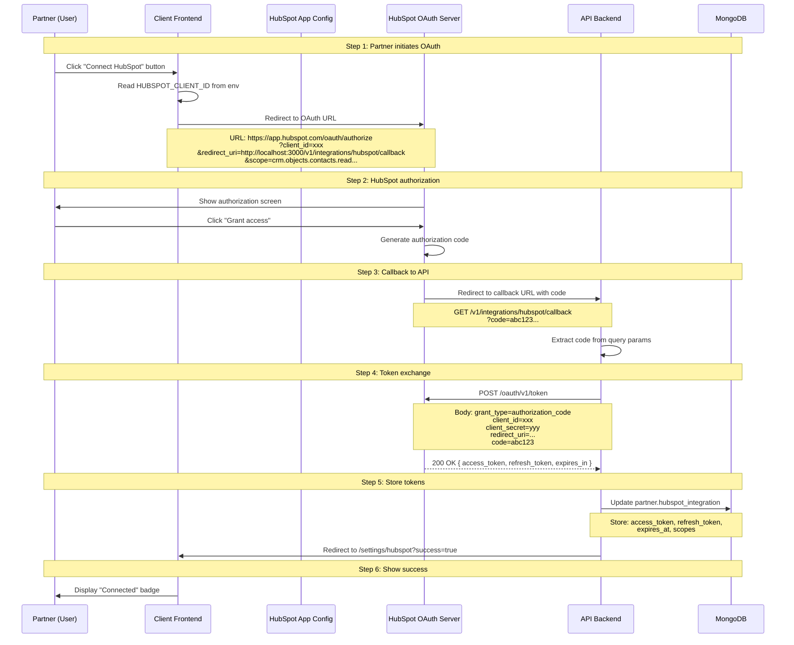

# HubSpot OAuth 2.0 Integration Guide

**Last Updated:** January 28, 2026
**Version:** 1.0
**Status:** Production

---

## Table of Contents

1. [Overview](#overview)
2. [The 3-Repository Flow](#the-3-repository-flow)
3. [Configuration (HubSpot App)](#configuration-hubspot-app)
4. [Frontend Initiation (Client)](#frontend-initiation-client)
5. [Backend Processing (API)](#backend-processing-api)
6. [Testing the Integration](#testing-the-integration)
7. [Common Errors & Solutions](#common-errors--solutions)
8. [Token Lifecycle Management](#token-lifecycle-management)
9. [Security Best Practices](#security-best-practices)

---

## Overview

> **Important**: This guide documents **Integration 2 (Marketplace OAuth)** only.
>
> Partner Connector has TWO separate HubSpot integrations:
> - **Integration 1 (ChiliPiper)**: Belkins website leads routed to partners via ChiliPiper - partners do NOT connect HubSpot
> - **Integration 2 (Marketplace)**: Partners connect their HubSpot for automated P2P marketplace - documented in this guide
>
> See [ARCHITECTURE.md](./ARCHITECTURE.md#hubspot-integration-distinction) for complete comparison.

### What is OAuth 2.0?

OAuth 2.0 is an authorization framework that allows Partner Connector to access a partner's HubSpot CRM data without storing their HubSpot password.

**The Flow:**
1. Partner clicks "Connect HubSpot" in Partner Connector
2. Partner redirected to HubSpot to grant permissions
3. HubSpot redirects back to Partner Connector with authorization code
4. Partner Connector exchanges code for access token
5. Partner Connector uses token to sync CRM data

---

### Why 3 Repositories?

| Repository | Role | Why It's Needed |
|------------|------|----------------|
| **HubSpot App** | OAuth configuration | Defines what we can access (scopes) |
| **Client (Frontend)** | User interface | Initiates OAuth, displays connection status |
| **API (Backend)** | Token management | Receives callback, stores tokens, makes API calls |

**Critical:** All 3 must agree on:
- `client_id` (from HubSpot app)
- `redirect_uri` (must match exactly)
- `scopes` (must match what's in app.json)

---

## The 3-Repository Flow



---

## Configuration (HubSpot App)

### Location

**Repository:** `partner-connector-hubspot-app`
**File:** `src/app/app.json`

---

### Required Fields

```json
{
  "name": "Partner Connector",
  "description": "Lead marketplace integration",
  "scopes": {
    "crm": [
      "crm.objects.contacts.read",
      "crm.objects.contacts.write",
      "crm.objects.deals.read",
      "crm.objects.deals.write",
      "crm.schemas.contacts.read",
      "crm.schemas.deals.read"
    ]
  },
  "redirectUrls": [
    "http://localhost:3000/v1/integrations/hubspot/callback",
    "https://staging-api.partners.belkins.io/v1/integrations/hubspot/callback",
    "https://api.partners.belkins.io/v1/integrations/hubspot/callback"
  ],
  "webhooks": {
    "targetUrl": "https://api.partners.belkins.io/v1/leads/webhooks/hubspot",
    "subscriptions": [
      {
        "subscriptionType": "contact.propertyChange",
        "propertyName": "*"
      },
      {
        "subscriptionType": "deal.propertyChange",
        "propertyName": "*"
      }
    ]
  }
}
```

---

### Scope Breakdown

| Scope | Purpose | Used By |
|-------|---------|---------|
| `crm.objects.contacts.read` | Read contact properties | Lead import, sync |
| `crm.objects.contacts.write` | Update contact properties | Bidirectional sync |
| `crm.objects.deals.read` | Read deal properties | Lead import, stage mapping |
| `crm.objects.deals.write` | Create/update deals | Bidirectional sync |
| `crm.schemas.contacts.read` | Read custom properties | Stage mapping |
| `crm.schemas.deals.read` | Read pipelines/stages | Stage mapping |

**Note:** Scopes are granted once during OAuth. To add new scopes, partners must re-authorize.

---

### Redirect URI Rules

**Critical Requirements:**
1. ✅ Must match EXACTLY (including protocol, port, path)
2. ✅ Must be whitelisted in HubSpot app settings
3. ✅ Must use HTTPS in production (HTTP allowed for localhost)
4. ❌ Cannot use wildcards (must list each environment)

**Examples:**

```bash
# ✅ Valid redirect URIs
http://localhost:3000/v1/integrations/hubspot/callback
https://staging-api.partners.belkins.io/v1/integrations/hubspot/callback
https://api.partners.belkins.io/v1/integrations/hubspot/callback

# ❌ Invalid (will cause redirect_uri_mismatch error)
http://localhost:3000/v1/integrations/hubspot/callback/  # Trailing slash
https://api.partners.belkins.io/integrations/hubspot/callback  # Missing /v1
```

---

### Deployment to HubSpot

```bash
# 1. Install HubSpot CLI
npm install -g @hubspot/cli

# 2. Authenticate with HubSpot
cd partner-connector-hubspot-app
hs auth

# 3. Upload app configuration
hs project upload

# 4. View app details
hs project open
```

**Result:** HubSpot creates an OAuth app with `client_id` and `client_secret`

---

## Frontend Initiation (Client)

### Location

**Repository:** `client`
**File:** `pages/settings/hubspot.vue`

---

### Environment Variables

```env
# File: client/.env
NUXT_PUBLIC_HUBSPOT_CLIENT_ID=12345678-1234-1234-1234-123456789012
NUXT_PUBLIC_HUBSPOT_REDIRECT_URI=http://localhost:3000/v1/integrations/hubspot/callback
```

**Note:** Must use `NUXT_PUBLIC_` prefix to expose to browser

---

### Connect Button Component

```vue
<template>
  <div class="hubspot-integration">
    <div v-if="!isConnected" class="not-connected">
      <h3>Connect Your HubSpot Account</h3>
      <p>
        Sync your CRM contacts and deals with Partner Connector
      </p>
      <button @click="connectHubSpot" class="btn-primary">
        Connect HubSpot
      </button>
    </div>

    <div v-else class="connected">
      <div class="status-badge success">
        <Icon name="check-circle" />
        Connected
      </div>
      <p>Last synced: {{ lastSyncedAt }}</p>
      <button @click="syncNow" class="btn-secondary">
        Sync Now
      </button>
      <button @click="disconnect" class="btn-danger">
        Disconnect
      </button>
    </div>
  </div>
</template>

<script setup lang="ts">
import { ref, onMounted } from 'vue'
import { useRouter, useRoute } from 'vue-router'
import { usePartner } from '@/composables/usePartner'

const router = useRouter()
const route = useRoute()
const { currentPartner, fetchPartner } = usePartner()

const isConnected = ref(false)
const lastSyncedAt = ref<string | null>(null)

onMounted(async () => {
  // Check for OAuth callback success
  if (route.query.success === 'true') {
    showSuccessToast('HubSpot connected successfully!')
  }
  if (route.query.error) {
    showErrorToast(`Connection failed: ${route.query.error}`)
  }

  // Fetch partner data to check connection status
  await fetchPartner()
  isConnected.value = !!currentPartner.value?.hubspot_integration?.access_token
  lastSyncedAt.value = currentPartner.value?.hubspot_integration?.last_synced_at
})

function connectHubSpot() {
  const config = useRuntimeConfig()
  const clientId = config.public.hubspotClientId
  const redirectUri = config.public.hubspotRedirectUri

  // Construct OAuth URL
  const scopes = [
    'crm.objects.contacts.read',
    'crm.objects.contacts.write',
    'crm.objects.deals.read',
    'crm.objects.deals.write',
    'crm.schemas.contacts.read',
    'crm.schemas.deals.read',
  ].join('%20')

  const oauthUrl = `https://app.hubspot.com/oauth/authorize?client_id=${clientId}&redirect_uri=${encodeURIComponent(redirectUri)}&scope=${scopes}`

  // Redirect to HubSpot
  window.location.href = oauthUrl
}

async function syncNow() {
  try {
    await $fetch('/v1/integrations/hubspot/sync', { method: 'POST' })
    showSuccessToast('Sync started')
    await fetchPartner() // Refresh status
  } catch (error) {
    showErrorToast('Sync failed')
  }
}

async function disconnect() {
  if (!confirm('Are you sure you want to disconnect HubSpot?')) return

  try {
    await $fetch('/v1/integrations/hubspot/disconnect', { method: 'DELETE' })
    showSuccessToast('Disconnected from HubSpot')
    isConnected.value = false
  } catch (error) {
    showErrorToast('Disconnect failed')
  }
}
</script>
```

---

### Key Implementation Details

1. **OAuth URL Construction**
   ```typescript
   const oauthUrl = `https://app.hubspot.com/oauth/authorize` +
     `?client_id=${clientId}` +
     `&redirect_uri=${encodeURIComponent(redirectUri)}` +
     `&scope=${scopes.join('%20')}`
   ```

2. **Redirect URI Encoding**
   - Always use `encodeURIComponent()` for redirect_uri
   - Prevents issues with special characters

3. **Scope Format**
   - Space-separated: `scope=crm.objects.contacts.read crm.objects.deals.read`
   - URL-encoded: `%20` between scopes

4. **Callback Handling**
   - Check `route.query.success` for success message
   - Check `route.query.error` for error message
   - Both set by API redirect after OAuth

---

## Backend Processing (API)

### Location

**Repository:** `api`
**Files:**
- `src/modules/integrations/integrations.controller.ts` - Callback endpoint
- `src/modules/integrations/integrations.service.ts` - Token exchange logic
- `src/modules/partners/partners.schema.ts` - Database schema

---

### Environment Variables

```env
# File: api/.env
HUBSPOT_CLIENT_ID=12345678-1234-1234-1234-123456789012
HUBSPOT_CLIENT_SECRET=xxxxxxxx-xxxx-xxxx-xxxx-xxxxxxxxxxxx
HUBSPOT_REDIRECT_URI=http://localhost:3000/v1/integrations/hubspot/callback
```

**Security:** Never commit `.env` file - use `.env.example` template

---

### Callback Endpoint

```typescript
// File: src/modules/integrations/integrations.controller.ts

@Controller({ path: 'integrations/hubspot', version: '1' })
export class IntegrationsController {
  constructor(
    private readonly integrationsService: IntegrationsService,
    private readonly configService: ConfigService,
  ) {}

  @Get('callback')
  @HttpCode(HttpStatus.FOUND) // 302 redirect
  async handleOAuthCallback(
    @Query('code') code: string,
    @Query('error') error: string,
    @Res() res: Response,
  ) {
    const clientUrl = this.configService.get<string>('CLIENT_URL');

    // Handle errors from HubSpot
    if (error) {
      this.logger.error(`OAuth error: ${error}`);
      return res.redirect(`${clientUrl}/settings/hubspot?error=${error}`);
    }

    // Validate code exists
    if (!code) {
      this.logger.error('No authorization code received');
      return res.redirect(
        `${clientUrl}/settings/hubspot?error=missing_code`,
      );
    }

    try {
      // Extract partner ID from session/token
      // In production, use authenticated session
      const partnerId = req.user?.partnerId; // Assuming AuthGuard sets req.user

      // Exchange code for tokens
      await this.integrationsService.exchangeCodeForTokens(partnerId, code);

      // Redirect to success page
      return res.redirect(`${clientUrl}/settings/hubspot?success=true`);
    } catch (err) {
      this.logger.error('Token exchange failed', err.stack);
      return res.redirect(
        `${clientUrl}/settings/hubspot?error=token_exchange_failed`,
      );
    }
  }
}
```

---

### Token Exchange Service

```typescript
// File: src/modules/integrations/integrations.service.ts

@Injectable()
export class IntegrationsService {
  private readonly logger = new Logger(IntegrationsService.name);

  constructor(
    private readonly configService: ConfigService,
    private readonly partnersRepository: PartnersRepository,
    @InjectQueue(QUEUES.HUBSPOT_SYNC) private readonly syncQueue: Queue,
  ) {}

  async exchangeCodeForTokens(
    partnerId: string,
    authorizationCode: string,
  ): Promise<void> {
    const clientId = this.configService.get<string>('HUBSPOT_CLIENT_ID');
    const clientSecret = this.configService.get<string>('HUBSPOT_CLIENT_SECRET');
    const redirectUri = this.configService.get<string>('HUBSPOT_REDIRECT_URI');

    // 1. Exchange authorization code for tokens
    const tokenUrl = 'https://api.hubapi.com/oauth/v1/token';
    const tokenResponse = await fetch(tokenUrl, {
      method: 'POST',
      headers: {
        'Content-Type': 'application/x-www-form-urlencoded',
      },
      body: new URLSearchParams({
        grant_type: 'authorization_code',
        client_id: clientId,
        client_secret: clientSecret,
        redirect_uri: redirectUri,
        code: authorizationCode,
      }).toString(),
    });

    if (!tokenResponse.ok) {
      const errorText = await tokenResponse.text();
      this.logger.error(`Token exchange failed: ${errorText}`);
      throw new BadRequestException('Failed to exchange authorization code');
    }

    const tokenData = await tokenResponse.json();
    const {
      access_token,
      refresh_token,
      expires_in, // Seconds until expiration
    } = tokenData;

    // 2. Calculate token expiration timestamp
    const expiresAt = new Date(Date.now() + expires_in * 1000);

    // 3. Store tokens in database
    await this.partnersRepository.updateOne(
      { _id: partnerId },
      {
        $set: {
          'hubspot_integration.access_token': access_token,
          'hubspot_integration.refresh_token': refresh_token,
          'hubspot_integration.expires_at': expiresAt,
          'hubspot_integration.connected_at': new Date(),
        },
      },
    );

    this.logger.log(`HubSpot connected for partner ${partnerId}`);

    // 4. Trigger initial sync (optional)
    await this.syncQueue.add('initial-sync', { partnerId });
  }
}
```

---

### Database Schema

```typescript
// File: src/modules/partners/partners.schema.ts

@Schema()
export class HubSpotIntegration {
  @Prop({ type: String })
  access_token?: string;

  @Prop({ type: String })
  refresh_token?: string;

  @Prop({ type: Date })
  expires_at?: Date;

  @Prop({ type: Date })
  connected_at?: Date;

  @Prop({ type: Date })
  last_synced_at?: Date;

  @Prop({ type: [String], default: [] })
  scopes: string[];
}

@Schema({ timestamps: true, collection: 'partners' })
export class Partner {
  @Prop({ required: true })
  name: string;

  @Prop({ type: HubSpotIntegration, default: () => ({}) })
  hubspot_integration: HubSpotIntegration;

  // ... other fields
}
```

---

### Token Refresh Logic

```typescript
// File: src/modules/integrations/integrations.service.ts

async refreshAccessToken(partnerId: string): Promise<string> {
  const partner = await this.partnersRepository.getOne({ _id: partnerId });
  if (!partner?.hubspot_integration?.refresh_token) {
    throw new UnauthorizedException('No refresh token available');
  }

  const clientId = this.configService.get<string>('HUBSPOT_CLIENT_ID');
  const clientSecret = this.configService.get<string>('HUBSPOT_CLIENT_SECRET');

  const tokenUrl = 'https://api.hubapi.com/oauth/v1/token';
  const tokenResponse = await fetch(tokenUrl, {
    method: 'POST',
    headers: {
      'Content-Type': 'application/x-www-form-urlencoded',
    },
    body: new URLSearchParams({
      grant_type: 'refresh_token',
      client_id: clientId,
      client_secret: clientSecret,
      refresh_token: partner.hubspot_integration.refresh_token,
    }).toString(),
  });

  if (!tokenResponse.ok) {
    this.logger.error('Token refresh failed');
    throw new UnauthorizedException('Token refresh failed');
  }

  const tokenData = await tokenResponse.json();
  const { access_token, refresh_token, expires_in } = tokenData;
  const expiresAt = new Date(Date.now() + expires_in * 1000);

  // Update tokens in database
  await this.partnersRepository.updateOne(
    { _id: partnerId },
    {
      $set: {
        'hubspot_integration.access_token': access_token,
        'hubspot_integration.refresh_token': refresh_token,
        'hubspot_integration.expires_at': expiresAt,
      },
    },
  );

  return access_token;
}

// Helper method to get valid access token (auto-refresh if expired)
async getValidAccessToken(partnerId: string): Promise<string> {
  const partner = await this.partnersRepository.getOne({ _id: partnerId });
  if (!partner?.hubspot_integration?.access_token) {
    throw new UnauthorizedException('HubSpot not connected');
  }

  const now = new Date();
  const expiresAt = partner.hubspot_integration.expires_at;

  // Refresh if expired or expiring within 5 minutes
  if (!expiresAt || now >= new Date(expiresAt.getTime() - 5 * 60 * 1000)) {
    this.logger.log(`Refreshing access token for partner ${partnerId}`);
    return this.refreshAccessToken(partnerId);
  }

  return partner.hubspot_integration.access_token;
}
```

---

## Testing the Integration

### Local Development Setup

**Prerequisites:**
1. ✅ HubSpot developer account ([developers.hubspot.com](https://developers.hubspot.com))
2. ✅ Test HubSpot portal with sample data
3. ✅ All 3 repositories running locally

---

### Step 1: Configure HubSpot App

```bash
# 1. Clone HubSpot app repo
cd partner-connector-hubspot-app

# 2. Install HubSpot CLI
npm install -g @hubspot/cli

# 3. Authenticate
hs auth
# Follow prompts to log in

# 4. Edit app.json - set redirect URI
nano src/app/app.json
# Change redirectUrls to: ["http://localhost:3000/v1/integrations/hubspot/callback"]

# 5. Upload to HubSpot
hs project upload

# 6. Copy client_id and client_secret from HubSpot dashboard
# Go to: https://app.hubspot.com/developer/{accountId}/applications
```

---

### Step 2: Configure Environment Variables

```bash
# API .env
cd ../api
nano .env

# Add these lines (replace with your values)
HUBSPOT_CLIENT_ID=12345678-1234-1234-1234-123456789012
HUBSPOT_CLIENT_SECRET=xxxxxxxx-xxxx-xxxx-xxxx-xxxxxxxxxxxx
HUBSPOT_REDIRECT_URI=http://localhost:3000/v1/integrations/hubspot/callback

# Client .env
cd ../client
nano .env

# Add these lines
NUXT_PUBLIC_HUBSPOT_CLIENT_ID=12345678-1234-1234-1234-123456789012
NUXT_PUBLIC_HUBSPOT_REDIRECT_URI=http://localhost:3000/v1/integrations/hubspot/callback
```

---

### Step 3: Start All Services

```bash
# Terminal 1: Start API
cd api
pnpm start:dev  # Includes Redis

# Terminal 2: Start Client
cd client
pnpm dev

# Terminal 3: MongoDB + Redis (if not using Docker)
mongosh "your-mongodb-url"
redis-cli ping
```

---

### Step 4: Test OAuth Flow

**4.1 Initiate OAuth**
1. Open browser: http://localhost:8000
2. Sign in as admin user
3. Navigate to Settings → HubSpot
4. Click "Connect HubSpot" button
5. You should be redirected to HubSpot

**4.2 Authorize on HubSpot**
1. HubSpot shows authorization screen
2. Review requested permissions
3. Click "Grant access"
4. You should be redirected back to Partner Connector

**4.3 Verify Success**
1. Should land on: http://localhost:8000/settings/hubspot?success=true
2. Page should show "Connected" badge
3. "Sync Now" button should be enabled

---

### Step 5: Verify Token Storage

```bash
# Connect to MongoDB
mongosh "your-mongodb-url"

# Use database
use partner-connector

# Find partner document
db.partners.findOne(
  { name: "Your Partner Name" },
  { hubspot_integration: 1 }
)

# Expected output:
{
  _id: ObjectId("..."),
  hubspot_integration: {
    access_token: "CJ...", // Long token string
    refresh_token: "CR...",
    expires_at: ISODate("2026-01-29T12:00:00.000Z"),
    connected_at: ISODate("2026-01-28T12:00:00.000Z"),
    scopes: [
      "crm.objects.contacts.read",
      "crm.objects.contacts.write",
      // ... more scopes
    ]
  }
}
```

---

### Step 6: Test API Calls with Token

```bash
# Get valid access token (auto-refreshes if expired)
curl -X GET http://localhost:3000/v1/integrations/hubspot/token \
  -H "Cookie: access_token=YOUR_JWT_TOKEN"

# Response:
{
  "access_token": "CJ...",
  "expires_at": "2026-01-29T12:00:00.000Z"
}

# Test HubSpot API call (get contacts)
curl -X GET "https://api.hubapi.com/crm/v3/objects/contacts?limit=10" \
  -H "Authorization: Bearer CJ..."

# Response: Array of contact objects
```

---

## Common Errors & Solutions

### 1. `redirect_uri_mismatch`

**Error Message:**
```
error=redirect_uri_mismatch
error_description=Redirect URI does not match
```

**Cause:** Redirect URI in OAuth request doesn't match HubSpot app configuration

**Solutions:**

✅ **Solution 1: Verify exact match**
```bash
# Check HubSpot app app.json
cat partner-connector-hubspot-app/src/app/app.json | grep redirectUrls

# Check API .env
cat api/.env | grep HUBSPOT_REDIRECT_URI

# Check Client .env
cat client/.env | grep HUBSPOT_REDIRECT_URI

# All 3 must match EXACTLY:
# ✅ http://localhost:3000/v1/integrations/hubspot/callback
# ❌ http://localhost:3000/v1/integrations/hubspot/callback/  (trailing slash)
# ❌ https://localhost:3000/v1/integrations/hubspot/callback  (https vs http)
```

✅ **Solution 2: Re-upload HubSpot app**
```bash
cd partner-connector-hubspot-app
hs project upload
```

---

### 2. `invalid_client`

**Error Message:**
```
{
  "status": "error",
  "message": "invalid_client",
  "correlationId": "..."
}
```

**Cause:** Wrong `client_id` or `client_secret`

**Solutions:**

✅ **Solution 1: Verify credentials**
```bash
# Go to HubSpot Developer Dashboard
open https://app.hubspot.com/developer/{accountId}/applications

# Copy client_id and client_secret
# Update API .env
nano api/.env
# Set: HUBSPOT_CLIENT_ID=...
# Set: HUBSPOT_CLIENT_SECRET=...

# Restart API
cd api && pnpm start:dev
```

---

### 3. Token Exchange Failed

**Error Message:**
```
BadRequestException: Failed to exchange authorization code
```

**Cause:** Authorization code already used or expired

**Solutions:**

✅ **Solution 1: Code can only be used once**
- Authorization codes expire after 1 minute
- Each code can only be exchanged once
- If exchange fails, partner must re-authorize (new OAuth flow)

✅ **Solution 2: Check API logs**
```bash
# API logs show detailed error from HubSpot
tail -f api/logs/combined.log

# Look for:
[IntegrationsService] Token exchange failed: {...}
```

---

### 4. Missing `code` Parameter

**Error Message:**
```
error=missing_code
```

**Cause:** HubSpot didn't return authorization code

**Solutions:**

✅ **Solution 1: Check OAuth URL**
```typescript
// Verify OAuth URL includes all required params
const oauthUrl = `https://app.hubspot.com/oauth/authorize` +
  `?client_id=${clientId}` +          // ✅ Required
  `&redirect_uri=${redirectUri}` +    // ✅ Required
  `&scope=${scopes}`;                 // ✅ Required
```

✅ **Solution 2: Check browser console**
- Open DevTools → Console
- Look for redirect errors
- Check Network tab for failed requests

---

### 5. Token Expired (401 Unauthorized)

**Error Message:**
```
{
  "statusCode": 401,
  "message": "Unauthorized",
  "correlationId": "..."
}
```

**Cause:** Access token expired (6 hours lifetime)

**Solutions:**

✅ **Solution 1: Auto-refresh enabled**
- API automatically refreshes expired tokens
- Use `getValidAccessToken()` method instead of reading from DB directly

✅ **Solution 2: Manual refresh**
```bash
curl -X POST http://localhost:3000/v1/integrations/hubspot/refresh \
  -H "Cookie: access_token=YOUR_JWT_TOKEN"
```

---

### 6. Partner Not Found

**Error Message:**
```
UnauthorizedException: HubSpot not connected
```

**Cause:** Partner document missing `hubspot_integration` field

**Solutions:**

✅ **Solution 1: Verify partner exists**
```bash
mongosh "your-mongodb-url"
use partner-connector
db.partners.findOne({ _id: ObjectId("...") })
```

✅ **Solution 2: Re-run OAuth flow**
- Disconnect and reconnect HubSpot
- This creates/updates `hubspot_integration` field

---

## Token Lifecycle Management

### Token Expiration

| Token Type | Lifetime | Refresh Strategy |
|------------|----------|-----------------|
| **Access Token** | 6 hours | Auto-refresh when < 5 min remaining |
| **Refresh Token** | No expiration | Rotated on each refresh |

---

### Auto-Refresh Implementation

```typescript
// Called before every HubSpot API request
const accessToken = await this.integrationsService.getValidAccessToken(partnerId);

// This method:
// 1. Checks if token expired or expiring soon (< 5 min)
// 2. If yes, calls refreshAccessToken()
// 3. Returns valid token
```

---

### Token Rotation

**What Happens:**
1. Partner authorizes → Get `access_token` + `refresh_token`
2. After 6 hours → `access_token` expires
3. API uses `refresh_token` to get new `access_token`
4. HubSpot issues new `access_token` + new `refresh_token`
5. API stores both new tokens

**Result:** Refresh tokens rotate, old ones become invalid

---

## Security Best Practices

### 1. Never Expose Secrets

❌ **Don't:**
```typescript
// WRONG - Secret in client-side code
const clientSecret = 'xxxxxxxx-xxxx-xxxx-xxxx-xxxxxxxxxxxx';
```

✅ **Do:**
```typescript
// CORRECT - Secret only in backend .env
const clientSecret = this.configService.get<string>('HUBSPOT_CLIENT_SECRET');
```

---

### 2. Always Use HTTPS in Production

❌ **Don't:**
```json
// WRONG - HTTP in production
{
  "redirectUrls": [
    "http://api.partners.belkins.io/v1/integrations/hubspot/callback"
  ]
}
```

✅ **Do:**
```json
// CORRECT - HTTPS in production
{
  "redirectUrls": [
    "https://api.partners.belkins.io/v1/integrations/hubspot/callback"
  ]
}
```

---

### 3. Validate Callback Parameters

❌ **Don't:**
```typescript
// WRONG - No validation
const code = req.query.code;
await exchangeCodeForTokens(code);
```

✅ **Do:**
```typescript
// CORRECT - Validate before use
if (!code || typeof code !== 'string') {
  throw new BadRequestException('Invalid authorization code');
}
await exchangeCodeForTokens(code);
```

---

### 4. Encrypt Tokens at Rest

✅ **Recommended (future enhancement):**
```typescript
import { createCipheriv, createDecipheriv } from 'crypto';

// Encrypt before storing
const encrypted = encrypt(accessToken, process.env.ENCRYPTION_KEY);
await partnersRepository.update({ 'hubspot_integration.access_token': encrypted });

// Decrypt when reading
const decrypted = decrypt(encrypted, process.env.ENCRYPTION_KEY);
```

---

## Next Steps

### For Developers
1. ✅ Review [Webhook Flow Guide](./WEBHOOK_FLOWS.md) - How webhooks complete the integration
2. ✅ Review [Bidirectional Sync Guide](https://github.com/partner-connector/api/blob/main/docs/SPRINT_11_PHASE_6_COMPLETE.md) - Two-way sync
3. ✅ Review [ARCHITECTURE.md](./ARCHITECTURE.md) - Full system architecture

### For Troubleshooting
1. Check API logs: `tail -f api/logs/combined.log`
2. Check MongoDB: `db.partners.findOne({ _id: ... })`
3. Test HubSpot API: `curl -H "Authorization: Bearer TOKEN" https://api.hubapi.com/crm/v3/objects/contacts`

---

**Last Updated:** January 28, 2026 | **Next Review:** February 28, 2026
